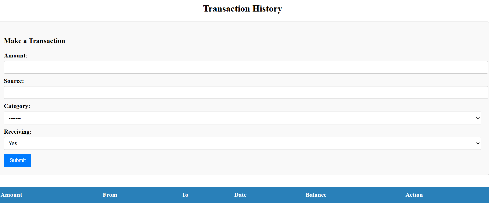

# Finance Manager Website

## Overview

The Finance Manager Website is a Django-based application that provides easy managing for your finance

## Features

- **Budgeting**: Implement budgets for specific categories
- **Transaction**: Record transactions.
- **Financial Goals**: Allocate money towards specific goals with due dates
- **Recurring Transactions**: Automatically add recurring transactions
- **User Accounts**: Secure login and account management.

## Technologies

- **Backend**: Django
- **Frontend**: HTML, CSS, JavaScript
- **Database**: SQLite

## Usage

1. **Recording Transactions**
   - Visit the transaction page to see transaction history.
   - You can also make a transaction yourself
  
2. **Managing Budgets**
   - Visit budget page to enter limits for spending
   - On the transaction page, you can bind each transaction to a specific budget
  
3. **Goals**
   - Visit the Finance page to make different finance goals
   - You can visit the save page to contribute to those goals

4. **Recurring Transactions**
   - Visit the Recurring page to add a recurring transaction
   - Now you don't have to worry about manually adding inn transaction every time, the app will do it for you

## Deployment

The project is deployed at https://finance.someonewhoexists.hackclub.app

## Contributing
Contributions are welcome! If you'd like to set up the project locally, follow these steps:

1. Clone the Repository
```bash
  git clone https://github.com/someonewhoexists1210/FinanceAPI.git
  cd FinanceAPI
```
2. Create a Virtual Environment

```bash

  python -m venv venv
```
3. Activate the Virtual Environment

### On Windows
```bash
venv\Scripts\activate
```

### On macOS/Linux:
```bash
source venv/bin/activate
```

4. Install Dependencies

```bash
pip install -r requirements.txt
```

5. Run Migrations

```bash
python manage.py migrate
```


6. Run the Development Server
```bash   
python manage.py runserver
```

Access the website at http://127.0.0.1:8000/.
Please ensure that your code adheres to the project's coding standards and includes appropriate tests before submitting a pull request.

## Screenshot


## Contact
For any questions or issues, please contact [darshdiv20@gmail.com] (mailto:darshdiv20@gmail.com)
